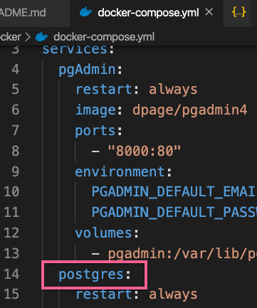

# TypeORM + Postgres + Docker

We use `Makefile` to easily have command.

## Docker

```
psql --host=postgres --username=me --dbname=testDb
```

## Build and Start

### Start the app

First time:

```
make local
```

Regular:

```
make local-dev
```

### Log

After you start the app, you can run the following command to watch your app.

```
make log
```

### Database

If you want to use `psql`, with password: `1234`.

```
make database
```

### App container

If you want to go into app container with shell.

```
make application
```

#### pgAdmin

`localhost:8000`

- account: 1234@admin.com
- password: 1234

Notice that when using docker, need to change database host to postgres container. (in `docker-compose.yml`)




## TypeORM

### CLI

```
# create simple app with typeorm
typeorm init --name server --database postgres

# create entity
typeorm entity:create -n User
```

### 1-Many Many-1

#### Entity

```typescript
// Photo
@Entity()
export class Photo {
  @PrimaryGeneratedColumn()
  id: number;

  @Column()
  url: string;

  @ManyToOne(
    type => User,
    user => user.photos
  )
  user: User;
}

// User
@Entity()
export class User {
  @PrimaryGeneratedColumn()
  id: number;

  @Column()
  name: string;

  @OneToMany(
    type => Photo,
    photo => photo.user
  )
  photos: Photo[];
}
```

#### CRUD

- create:

```typescript
const photo1 = new Photo();
photo1.url = "me.jpg";
await connection.manager.save(photo1);
const photo2 = new Photo();
photo2.url = "me-and-bears.jpg";
await connection.manager.save(photo2);
const user = new User();
user.name = "John";
user.photos = [photo1, photo2];
await connection.manager.save(user);
///
const user = new User();
user.name = "Leo";
await connection.manager.save(user);
const photo1 = new Photo();
photo1.url = "me.jpg";
photo1.user = user;
await connection.manager.save(photo1);
const photo2 = new Photo();
photo2.url = "me-and-bears.jpg";
photo2.user = user;
await connection.manager.save(photo2);
```

- read

```typescript
const userRepository = connection.getRepository(User);
const users = await userRepository.find({ relations: ["photos"] });

// or from inverse side

const photoRepository = connection.getRepository(Photo);
const photos = await photoRepository.find({ relations: ["user"] });
```

## nodemon

create file `nodemon.json`

```json
{
  "watch": ["src"],
  "ext": "ts",
  "ignore": ["src/**/*.spec.ts"],
  "exec": "ts-node ./src/index.ts"
}
```

in `package.json`

```json
"scripts": {
    "dev": "nodemon"
}
```

## Ref

https://medium.com/analytics-vidhya/getting-started-with-postgresql-using-docker-compose-34d6b808c47c
